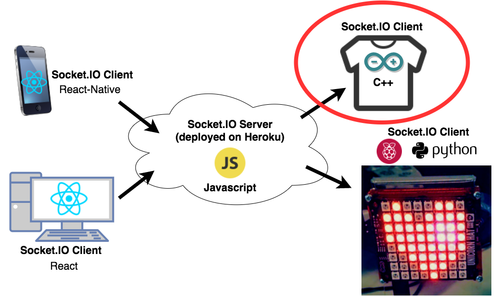

# [Raspberry Pi Interactive LED Art project](https://light-art.herokuapp.com)

This is my final project for [Harvard's CS50 Course](https://www.edx.org/course/introduction-computer-science-harvardx-cs50x) and first attempt at raspberry pi interactive art. The goal is to interact remotely with the raspberry pi and be able to create pixel art pattern to display on the UnicornHAT.

I used a lot of new, unfamiliar stuff for this project! e.g. Python, SocketIO, React-Native. 😏 But I had a lot of fun learning and figuring out how to build this project!

### My Setup:

##### Schema:

##### Server: Express

The Server is deployed to Heroku. It sits between the RPi and react web & native apps.

Using SocketIO, it is pushes state changes from the native and web apps to the RPi. The goal from the beginning was to make this accessible remotely, from anyone and anywhere in the world, not just on my local network.

##### **Clients:**
- **Raspberry Pi 3 w/ UnicornHAT 64-led board.**

  The RPi is coded in Python, since the UnicornHAT library is in Python. I created a python program that serves as a client with the socketio server, using a [python socketio client library](https://github.com/invisibleroads/socketIO-client), and listens for incoming messages from the other clients. It then interprets the messages and creates the LED light pattern using the [UnicornHAT library](https://github.com/pimoroni/unicorn-hat/).

  - **Feather Huzzah/Arduino + NeoPixels LED shirt**

    

    Written in C++(ish), this client is inside my shirt! It receives a message from the RPi with the 2 most used colors in a user's art design, and displays them synchronously with the pixel art design as it is shown.

    _Features:_

    - Color Palette
    - Notification if the Raspberry Pi is offline
    - Responsive design

- **ReactJS web app**

  

  Written in ES6 using React, this client is located on the server. Users on the web can create pixel art designs to display on the Raspberry Pi.

  _Features:_

  - Color Palette
  - Notification if the Raspberry Pi is offline
  - Responsive design

- **React-Native mobile app**

  

  Written in ES6 using React-Native (with the help of [ExponentJS](https://www.getexponent.com)), this client provides a native experience for both iOS and Android. Users can natively create pixel art designs to display on the Raspberry Pi.

  _Features:_

  - Color Palette (I rolled my own!)
  - Notification if the Raspberry Pi is offline

Made with 💚💙💜 by [Stephanie](https://traumverloren.github.io)
